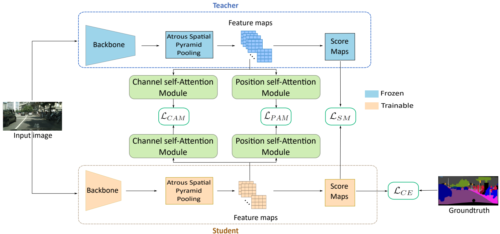
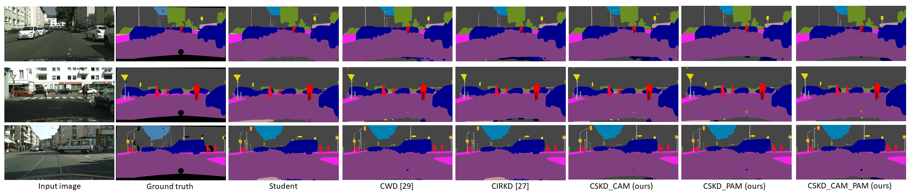

# CSKD: Channel-Spatial Knowledge Distillation for efficient semantic segmentation

This is the official implementation of our paper titled [Channel-spatial knowledge distillation for efficient semantic segmentation](https://www.sciencedirect.com/science/article/abs/pii/S016786552400059X)
## Overview
CSKD aims to force the student network to mimic the channel and position interdependencies of the teacher network. These interdependencies are captured using two self-attention modules: Channel self-Attention Module (CAM) and Position self-Attention Module (PAM). Interestingly, thanks to the Centered Kernel Alignment (CKA), dimension enhancement step for the student feature maps is not required.




## Requirement
Ubuntu 20.04 LTS \
Python 3.8 \
CUDA 12.1 \
PyTorch 1.13.1 

## Dataset & Training models

#### Datasets
[CityScapes](https://www.cityscapes-dataset.com/) \
[CamVid](https://pan.baidu.com/s/1Z0h4y1-4k0LP8OCGY_Xixw?pwd=bl12) \
[PascalVoc](https://pan.baidu.com/s/1MX2ea7rNRqbDqOKQ8E6XpQ?pwd=d2fp) 

#### Backbones pretrained on ImageNet
[resnet101-imagenet.pth](https://drive.google.com/file/d/1V8-E4wm2VMsfnNiczSIDoSM7JJBMARkP/view?usp=sharing) \
[resnet18-imagenet.pth](https://drive.google.com/file/d/1_i0n3ZePtQuh66uQIftiSwN7QAUlFb8_/view?usp=sharing) \
[mobilenetv2-imagenet.pth](https://drive.google.com/file/d/12EDZjDSCuIpxPv-dkk1vrxA7ka0b0Yjv/view?usp=sharing)  

#### Teachers
| Databases | Networks |
| -- | -- |
| Cityscapes | [DeepLabV3-ResNet101](https://drive.google.com/file/d/1zUdhYPYCDCclWU3Wo7GbbTlM8ibQ_UC1/view?usp=sharing)
| Cityscapes | [PSPNet-ResNet101](https://drive.google.com/file/d/13QjgK3ODe72gqcc8AnPhWZhCdChwePeJ/view?usp=sharing)
| CamVid | [DeepLabV3-ResNet101](https://drive.google.com/file/d/1BK8Flukoz-Mtd0e1iwFG5rLxi_ES76d2/view?usp=sharing)
| PascalVOC | [DeepLabV3-ResNet101](https://drive.google.com/file/d/1rYTaVq_ooiAI4oFOcDP8K3SpSbjURGnX/view?usp=sharing)

## Training
Example of training CSKD using DeepLabV3-ResNet101 as teacher and DeepLabV3-ResNet18 as student on CityScapes
```
bash sh_scripts/citys/deeplabr101_teacher/train_sa_deeplab-r101_deeplab-r18.sh
```

## Generating of segmentation maps
### Blend segmentation maps
Example of generating blend segmentation maps using DeepLabV3-ResNet18 distilled by CSKD on CityScapes
```
bash sh_scripts/citys/deeplabr101_teacher/test_sa_deeplab-r101_deeplab-mn2.sh
```
To generate the IoU of the test dataset, you should zip the resulting images and submit it to the [Cityscapes test server](https://www.cityscapes-dataset.com/submit/).
### Color palette segmentation maps (suitable for visualization)
Example of generating palette segmentation maps using DeepLabV3-ResNet18 distilled by CSKD on CityScapes
```
bash sh_scripts/citys/visualize/deeplabv3_resnet18_citys_student_cskd.sh 
```

Example of generated segmentation maps: 


[27] C. Yang, H. Zhou, Z. An, X. Jiang, Y. Xu, Q. Zhang, Cross-image relational knowledge distillation for semantic segmentation, in: Proceedings of the IEEE/CVF Conference on Computer Vision and Pattern Recognition, CVPR 2022, pp. 12319–12328. \
[29] C. Shu, Y. Liu, J. Gao, Z. Yan, C. Shen, Channel-wise knowledge distillation for dense prediction, in: Proceedings of the IEEE/CVF International Conference on Computer Vision, CVPR 2021, pp. 5311–5320. 

Do not hesitate to contact us if you have any questions

## Citation
If you use this code, please cite our paper:

```
@article{cskd,
  title={Channel-spatial knowledge distillation for efficient semantic segmentation},
  author={Ayoub Karine, Thibault Napoléon, Maher Jridi},
  journal={ELSEVIER Pattern Recognition Letters},
  volume={180},
  pages={58-54},
  year={2024}
}
```

## Acknowledgement
This codebase is heavily borrowed from [Cross-Image Relational Knowledge Distillation for Semantic Segmentation](https://github.com/winycg/CIRKD/). We would like to thank them for their excellent work.
